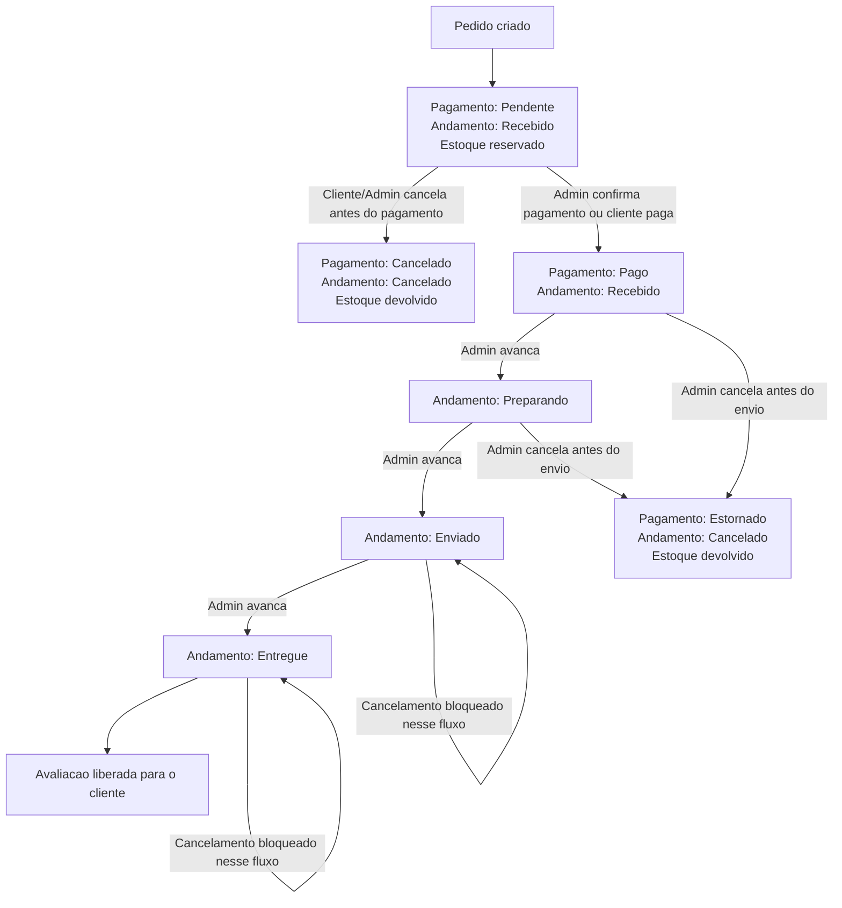

# Fluxo de Status do Pedido

## Estados de pagamento

- `PENDING`: pagamento pendente.
- `PAID`: pagamento confirmado.
- `REFUNDED`: pagamento estornado após cancelamento administrativo.
- `CANCELED`: pagamento cancelado antes de ser confirmado.

## Estados de andamento

- `CREATED`: pedido recebido.
- `PREPARING`: pedido em preparação.
- `SHIPPED`: pedido enviado.
- `DELIVERED`: pedido entregue.
- `CANCELED`: pedido cancelado.

## Regras principais

- O pedido nasce com pagamento pendente e andamento recebido.
- O estoque é reservado quando o pedido é criado.
- O cupom só conta uso quando o pagamento é confirmado.
- O andamento só avança depois do pagamento confirmado.
- O admin não deve pular etapas de andamento.
- O cliente só cancela antes do pagamento.
- Pedido pago cancelado pelo admin vira estornado e devolve estoque.
